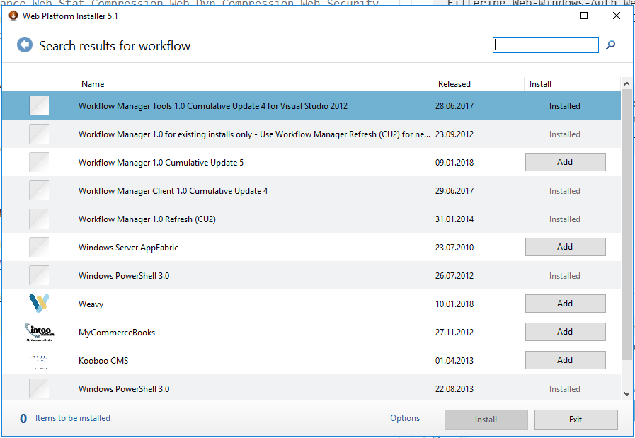

# Installation

## Service Accounts

SPFarm: requires local Admin, SQL DB Creator & SecurityAdmin

SPService: requires local Admin

## Office Online Server Installation

Install required Windows Services

```
Add-WindowsFeature Web-Server,Web-Mgmt-Tools,Web-Mgmt-Console,Web-WebServer,Web-Common-Http,Web-Default-Doc,Web-Static-Content,Web-Performance,Web-Stat-Compression,Web-Dyn-Compression,Web-Security,Web-Filtering,Web-Windows-Auth,Web-App-Dev,Web-Net-Ext45,Web-Asp-Net45,Web-ISAPI-Ext,Web-ISAPI-Filter,Web-Includes
```

Create Web Apps Server Farm

```
$WebAppsURL = "http://officeonline.spdom.local"
New-OfficeWebAppsFarm -InternalUrl $WebAppsURL -ExternalUrl $WebAppsURL -AllowHttp -EditingEnabled -Force
```

## Install Workflow Manager

Install [Web Platform Installer](https://www.microsoft.com/web/downloads/platform.aspx)



